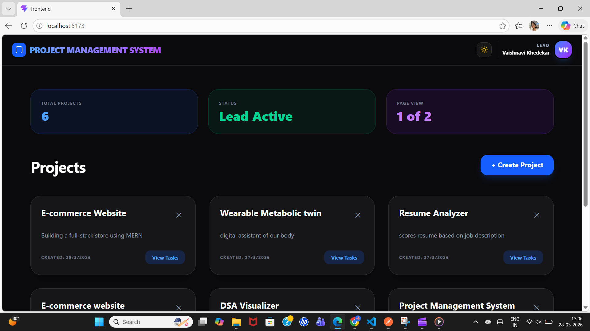
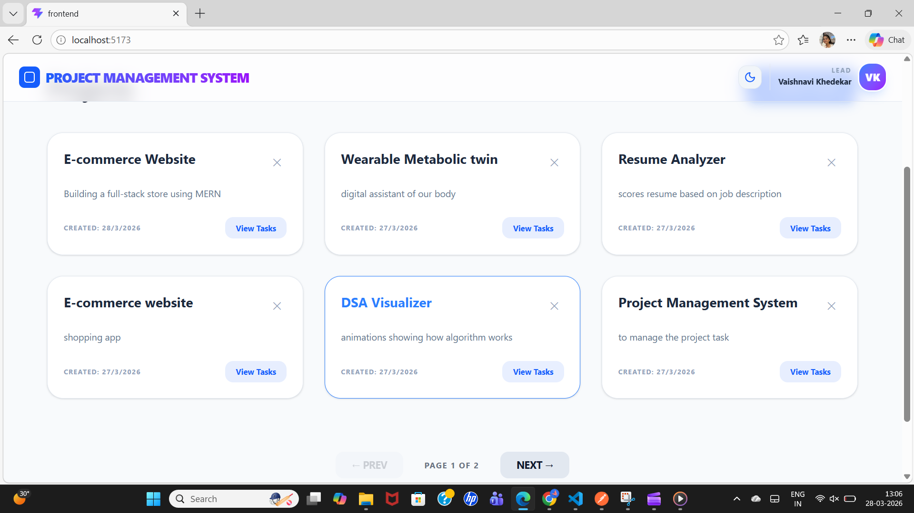
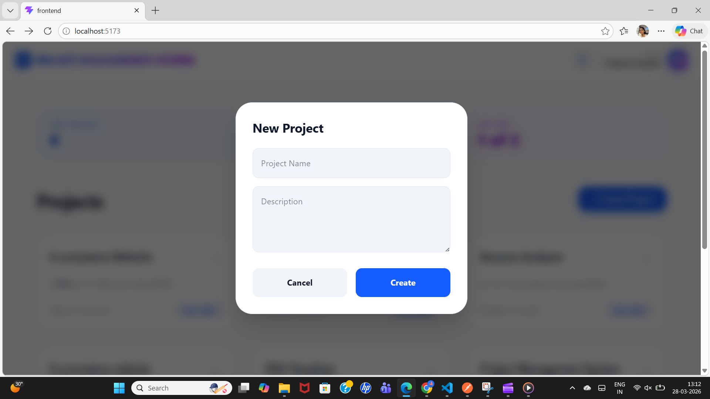
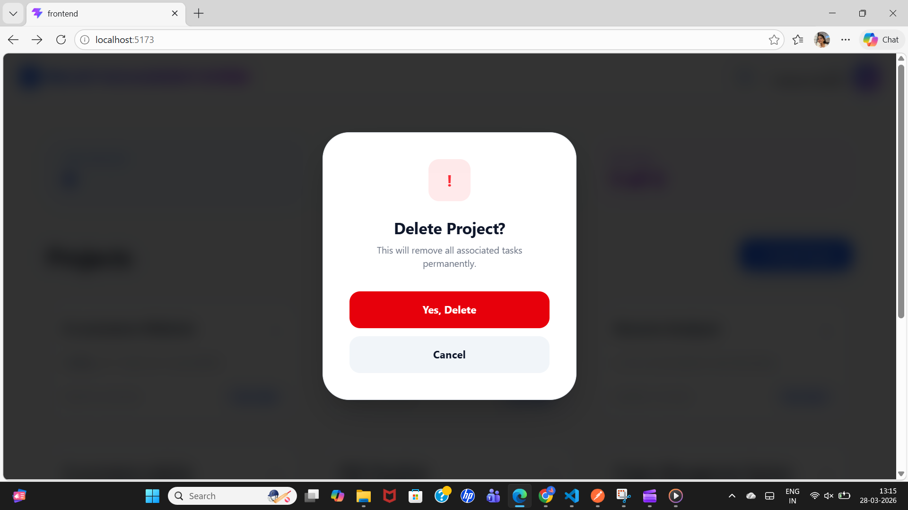
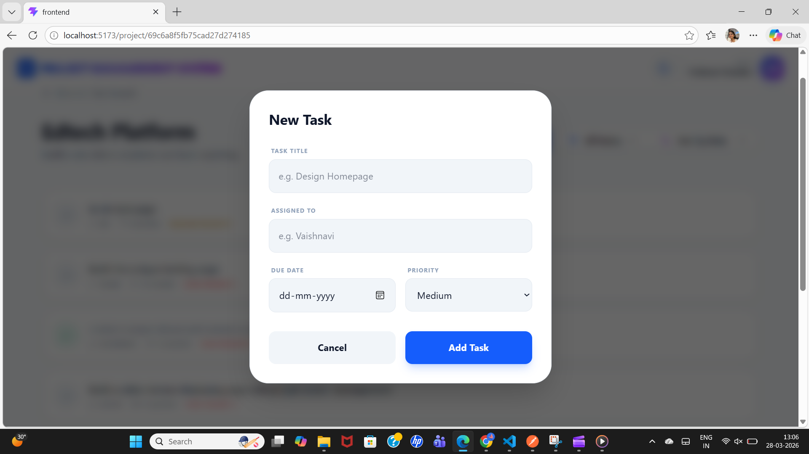
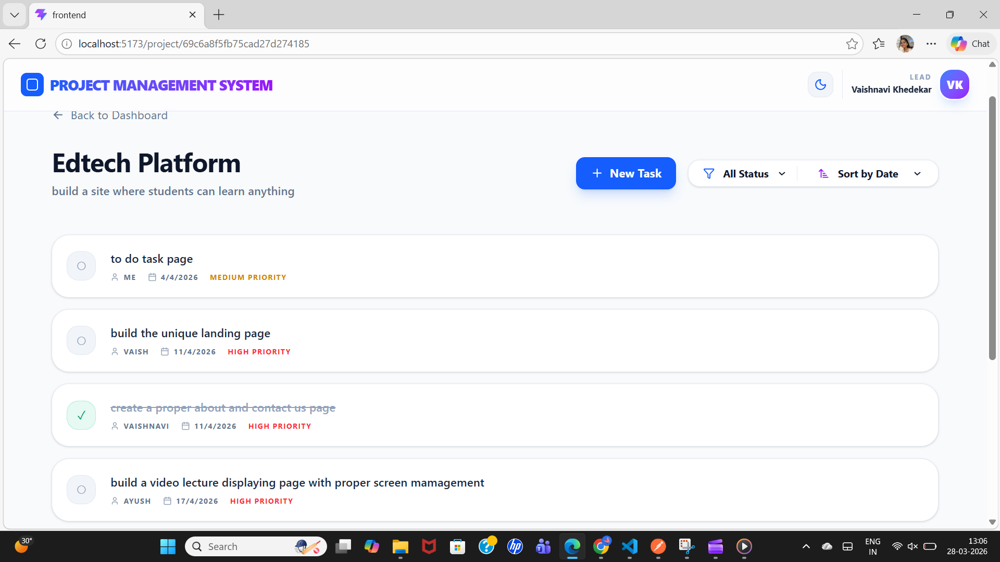
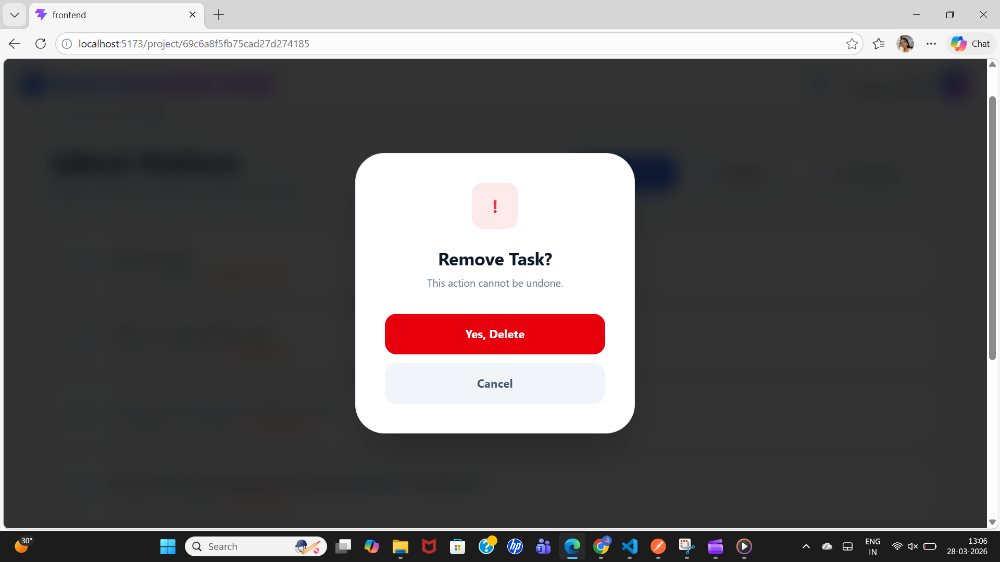

#  ProjectMS - Mini Project Management System

A high-performance MERN stack application designed for Project Leads to manage workflows efficiently. This project features a **Unique Glassmorphism UI** with adaptive **Light/Dark themes** and robust backend logic.

##  Key Features Built
- **Lead Dashboard:** A clean overview of all active projects with dynamic stats.
- **Advanced Pagination:** Server-side pagination (6 projects per page) for optimal performance.
- **Task Orchestration:** Leads can create tasks, assign topics, and set priorities (Low/Medium/High).
- **Dynamic UI/UX:** 
  - **Theme Toggle:** Smooth transition between professional Light and premium Dark modes.
  - **Glassmorphism Design:** Modern translucent cards and modals using Tailwind CSS.
  - **Smart Initials:** Navbar automatically generates user initials from the Lead's name.
- **Data Integrity:** 
  - **Filtering:** Filter tasks by status (Todo, In-Progress, Done).
  - **Sorting:** Sort tasks by Due Date to track urgency.
  - **Validation:** Strict server-side input validation using `express-validator`.
- **Professional Modals:** Custom-built confirmation modals replace standard browser alerts for a seamless experience.

##  Tech Stack
- **Frontend:** React.js, Tailwind CSS, Lucide Icons, React Router, Axios.
- **Backend:** Node.js, Express.js.
- **Database:** MongoDB (Mongoose ODM).
- **State & Utils:** React Hooks, LocalStorage (for theme/name persistence), React Hot Toast.

---

##  Setup & Installation Instructions

### 1. Prerequisites
- Install [Node.js](https://nodejs.org/)
- Install [MongoDB](https://www.mongodb.com/try/download/community) (Local) or use MongoDB Atlas (Cloud).

### 2. Backend Setup
1. Navigate to the `backend` folder: `cd backend`
2. Install dependencies: `npm install`
3. Create a `.env` file in the `backend` folder and add:
   ```text
   PORT=5000
   MONGO_URI=mongodb://127.0.0.1:27017/projectMS
Start the server: npm run dev

## 3. Frontend Setup
1. Open a new terminal and navigate to the frontend folder: cd frontend
2. Install dependencies: npm install
3. Start the Vite development server: npm run dev
4. Open your browser to: http://localhost:5173

## 4.  API Endpoints Summary
The project includes a full Postman Collection (ProjectManagementSystem.postman_collection.json) in the root directory.

# Projects
- POST /api/projects - Create a new project.
- GET /api/projects?page=1&limit=6 - Fetch paginated projects.
- DELETE /api/projects/:id - Cascade delete project and all its tasks.

# Tasks
- POST /api/projects/:id/tasks - Add a task to a project.
- GET /api/projects/:id/tasks?status=todo&sortBy=due_date - Fetch tasks with filters/sorting.
- PUT /api/tasks/:id - Update task status or topic.
- DELETE /api/tasks/:id - Remove a specific task.

## Project Architecture (Steps Followed)
1. Environment Initialization: Set up dual-folder structure (Backend/Frontend) with Vite and Express.
2. Schema Design: Built MongoDB models for Projects and Tasks with relational IDs.
3. API Development: Created controllers for CRUD operations, including logic for pagination and query filtering.
4. Middleware: Integrated express-validator for security and a global errorHandler for smooth API responses.
5. Frontend Core: Established routing and Axios instances for API consumption.
6. UI/UX Polishing: Implemented Tailwind Dark Mode logic and Glassmorphism styling.
7. Refinement: Replaced browser alert() with custom React Modals and added Toast notifications for real-time feedback.

## 📸 Visual Preview

### Dashboard (Dark & Light Mode)
<p align="center">
  
  
</p>

### Project Management
<p align="center">
   
  
</p>
### Task Management & Filtering
<p align="center">
   
  
  
</p>

## 🎥 Video Demo
[Click here to watch the Video Walkthrough](assets/VideoProject.mp4)
